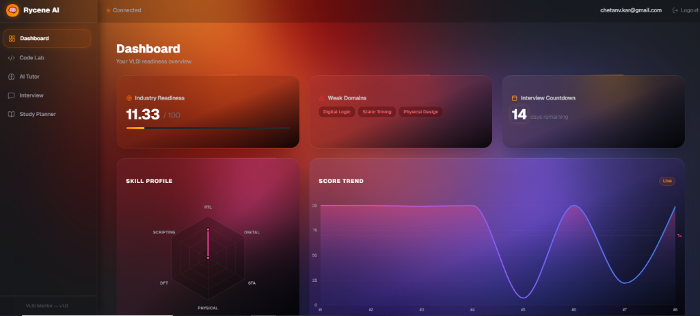
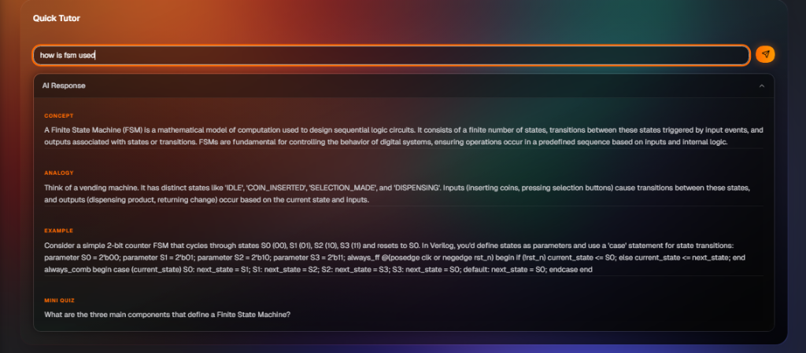

<div align="center">

# 🧠 Rycene AI
### *AI-Powered Skill Intelligence for VLSI Engineers*

[](https://nextjs.org/)
[](https://firebase.google.com/)
[](https://deepmind.google/technologies/gemini/)
[](https://www.typescriptlang.org/)

**[🚀 Live Platform](https://rycene-vlsi-mentor.vercel.app/)** | **[📖 Documentation](#)** 

<br/>



<br/>

*From Learning Content to Measurable Competency. Rycene AI closes the gap between academic learning and semiconductor industry readiness through real-time code evaluation and AI mentorship.*

</div>

---

## 🌌 The Future of Education is Intelligence

The semiconductor industry moves at lightspeed, but traditional education pipelines struggle to keep pace. Finding exceptional VLSI talent is harder than ever, and students are often left guessing what exact skills top-tier companies actually demand.

**Rycene AI is the bridge.** 

We aren't just an educational tool; we are a **Skill Intelligence Platform.** By harnessing the incredible reasoning capabilities of **Google's Gemini 1.5 AI**, Rycene provides real-time, personalized, and mathematically precise feedback to aspiring hardware engineers. 

We transform passive learning into active, measurable competency.

---

## 🔥 Features That Mesmerize

### 1. ⚡ Real-time Verilog Code Evaluation
Stop waiting hours for a teaching assistant. Rycene's AI core analyzes your RTL submissions instantly. It doesn't just check for syntax—it evaluates **Logic Correctness, Synthesis Readiness, and Code Quality**, returning a structured JSON rubric that updates your skill profile immediately.

### 2. 🧠 Adaptive AI Mentorship (The Quick Tutor)
Stuck on metastability? Confused by finite state machines? The **Quick Tutor** breaks down complex logic design concepts using analogies, detailed hardware examples, and mini-quizzes to ensure maximum retention.

<div align="center">

</div>

### 3. 🎯 Dynamic Skill Radar & Dashboard
Your growth isn't a feeling; it's data. Our mesmerizing, dark-mode glassmorphism dashboard features a live **Skill Radar** tracking six distinct VLSI domains (RTL, Digital, STA, Physical, DFT, Scripting). The platform utilizes Exponential Moving Averages (EWA) to score your readiness exactly how an employer would.

### 4. 📅 Generative Study Planning
Tell us your target role and your interview timeline. Rycene analyzes your weak domains from past evaluations and instantly hallucinates a tailored, day-by-day survival guide and study roadmap designed to make you hire-ready.

---

## 🛠️ Architecture

Rycene is built on a highly scalable, serverless architecture designed for speed and security:

- **Frontend:** Next.js 14 App Router (React), styled with Tailwind CSS and Framer Motion for mesmerizing UI micro-interactions and glowing hardware logic gates.
- **Backend:** Firebase (Authentication, Firestore DB).
- **Compute:** Firebase Cloud Functions (Node.js). Securely handles all Gemini generative tasks, enforcing strict JSON-schema responses and performing atomic database transactions.
- **AI Core:** Google DeepMind's Gemini 1.5 Flash API.

> *For a deep dive into how our Cloud Functions and Exponential Moving Average algorithms work, see the internal Architecture Documentation.*

---

## 👥 Meet the Team

Rycene AI was built by a passionate team of developers and VLSI enthusiasts dedicated to democratizing specialized education:

* **[Team Lead / Architect Name]** — System Architecture & Concept
* **[Frontend Engineer Name]** — UI/UX & Next.js Implementation
* **[Backend Engineer Name]** — Firebase & AI Integration
* **[VLSI Subject Matter Expert]** — Rubric Design & Prompt Engineering

*(Add your team's specific GitHub/LinkedIn links here to showcase your hard work!)*

---

## 🚀 Getting Started

If you want to spin up Rycene locally:

### Prerequisites
- Node.js (v18+)
- Firebase CLI installed globally
- A Google Gemini API Key

### Installation

1. **Clone the repo**
```bash
git clone https://github.com/Yasmeen-MS/rycene_vlsi_mentor.git
cd rycene_vlsi_mentor
```

2. **Frontend Setup**
```bash
cd frontend
npm install
# Create a .env.local file with your Firebase config
npm run dev
```

3. **Backend Setup (Functions)**
```bash
cd ../functions
npm install
firebase use --add
# Set your Gemini API key in Firebase Secret Manager
npm run build
firebase deploy --only functions
```

---

<div align="center">
<p className="text-sm font-medium">Built with 🧡 for the next generation of hardware engineers.</p>
</div>
